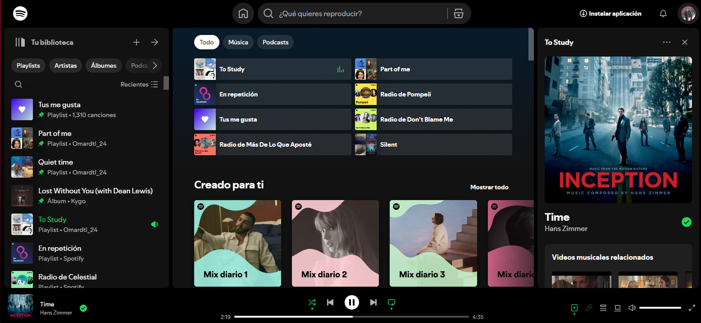

# Entrega Individual: Taller de HTML, CSS y Bootstrap

## Descripción

Esta entrega consiste en la creación de una página web que busca replicar la estética y funcionalidad de la página de Spotify. A través de este ejercicio, se aplicarán los conceptos básicos de HTML, CSS y Bootstrap para desarrollar una interfaz moderna y responsiva.

### Requisitos de la Página

Tu página web debe cumplir con los siguientes criterios:

- **Organización Clara:** Debe presentar una estructura organizada que permita una fácil navegación.
- **Contenido Mínimo:**
  - Al menos **una imagen** representativa.
  - Una **lista de información** relacionada con la música o artistas.
  - Un **formulario** para que los visitantes se suscriban.
  - Varios **párrafos de texto**, incluyendo al menos **un enlace a una página externa**.

- **Uso de Bootstrap:** La página debe utilizar la grilla y los estilos de Bootstrap para garantizar un diseño responsivo.
- **Estilos Propios:** Se deben definir estilos personalizados para formatear el texto.

## Pasos para la Creación de la Página

1. **Diseño de la Maqueta:**
   - Diseña la maqueta de la página que vas a construir, inspirándote en la página de Spotify.

2. **Implementación en Bootstrap:**
   - Utiliza la grilla de Bootstrap para plasmar tu diseño.

3. **Zona de Imagen:**
   - Crea una sección que contenga al menos una imagen representativa de Spotify.

4. **Zona de Texto:**
   - Incluye párrafos de texto, asegurándote de incluir al menos un enlace a una página externa relacionada con la música.

5. **Lista de Elementos:**
   - Crea una sección que contenga una lista de elementos, como álbumes o artistas.

6. **Formulario de Suscripción:**
   - Define un formulario donde los visitantes puedan registrarse para recibir más información sobre música o novedades.

## Ejemplo de Distribución de Elementos

## Recursos Adicionales

- [Documentación de Bootstrap](https://getbootstrap.com/docs/)
- [Guía de HTML y CSS en MDN](https://developer.mozilla.org/es/docs/Web)

## Conclusión

Al finalizar esta entrega, habrás aplicado los conceptos aprendidos en el taller y habrás creado una página web funcional y atractiva, replicando la estética de la página de Spotify utilizando HTML, CSS y Bootstrap.

